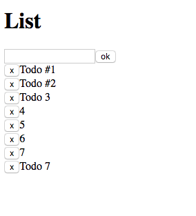

# iReactivity: Simple list example
It's just present idea [src/index.js](./src/index.js)
of iReactivity [https://www.npmjs.com/package/ireactivity](https://www.npmjs.com/package/ireactivity)

---



```jsx harmony
// src/index.js

import React from 'react';
import ReactDOM from 'react-dom';
import {Provider, connect} from 'ireactivity';
const uid = () => Math.random().toString(35).slice(2, 8).toUpperCase();

const store = {
    todos: [
        {title: 'Todo #1', id: uid()},
        {title: 'Todo #2', id: uid()}
    ]
};

const TodoView = ({todo, onRemove}) =>
    <div>
        <button onClick={() => onRemove(todo)}>x</button>
        {todo.title}
    </div>

const Todo = connect(TodoView, {
    onRemove: (store) => (todo) => {
        store.todos = store.todos.filter((aTodo) => todo !== aTodo)
    }
});

const TodosView = ({todos}) =>
    <div>
        {todos.map((todo) => <Todo key={todo.id} todo={todo}/>)}
    </div>;

const Todos = connect(TodosView, {
    todos: (store) => store.todos
});

const TodoPlusView = ({onClick}) => <button onClick={onClick}>Add</button>;

const TodoPlus = connect(TodoPlusView, {
    onClick: (store) => () => {
        let id = uid();
        store.todos = [...store.todos, {title: `Todo #${id}`, id: id}]
    }
});

const AppView = () => <div><h1>List</h1> <TodoPlus/> <Todos/></div>;

const App = AppView;

ReactDOM.render(
    <Provider store={store}><App/></Provider>,
    document.getElementById('root'));

```

## How to start
- `npm install`
- `npm start`

## iReactivity
[https://www.npmjs.com/package/ireactivity](https://www.npmjs.com/package/ireactivity) - Simple React binding 